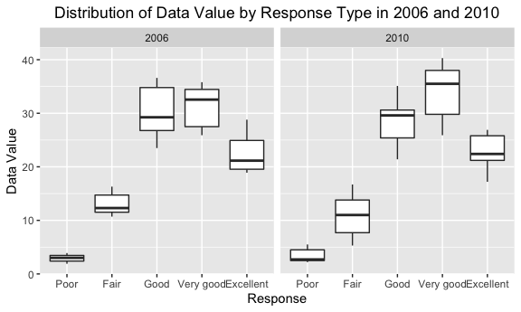
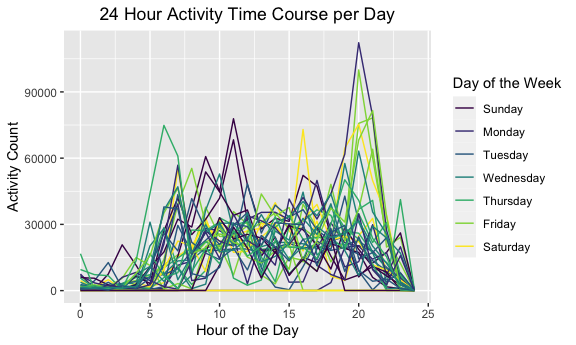

Homework 3
================
Philip Kim
10/12/2021

-   [Problem 1](#problem-1)
    -   [Dataset description](#dataset-description)
    -   [How many aisles are there, and which aisles are the most items
        ordered
        from?](#how-many-aisles-are-there-and-which-aisles-are-the-most-items-ordered-from)
    -   [Make a plot that shows the number of items ordered in each
        aisle, limiting this to aisles with more than 10000 items
        ordered. Arrange aisles sensibly, and organize your plot so
        others can read
        it.](#make-a-plot-that-shows-the-number-of-items-ordered-in-each-aisle-limiting-this-to-aisles-with-more-than-10000-items-ordered-arrange-aisles-sensibly-and-organize-your-plot-so-others-can-read-it)
    -   [Make a table showing the three most popular items in each of
        the aisles “baking ingredients”, “dog food care”, and “packaged
        vegetables fruits”. Include the number of times each item is
        ordered in your
        table.](#make-a-table-showing-the-three-most-popular-items-in-each-of-the-aisles-baking-ingredients-dog-food-care-and-packaged-vegetables-fruits-include-the-number-of-times-each-item-is-ordered-in-your-table)
    -   [Make a table showing the mean hour of the day at which Pink
        Lady Apples and Coffee Ice Cream are ordered on each day of the
        week; format this table for human readers (i.e. produce a 2 x 7
        table).](#make-a-table-showing-the-mean-hour-of-the-day-at-which-pink-lady-apples-and-coffee-ice-cream-are-ordered-on-each-day-of-the-week-format-this-table-for-human-readers-ie-produce-a-2-x-7-table)
-   [Problem 2](#problem-2)
    -   [Data Cleaning](#data-cleaning)
    -   [In 2002, which states were observed at 7 or more locations?
        What about in
        2010?](#in-2002-which-states-were-observed-at-7-or-more-locations-what-about-in-2010)
    -   [Spaghetti Plot](#spaghetti-plot)
    -   [Two-Panel Plot](#two-panel-plot)
-   [Problem 3](#problem-3)
    -   [Load and Tidy Data](#load-and-tidy-data)
    -   [Total Activity per Day](#total-activity-per-day)
    -   [24-hour activity time course
        plot](#24-hour-activity-time-course-plot)

``` r
library(tidyverse)
library(knitr)
library(p8105.datasets)

knitr::opts_chunk$set(
  fig.width = 6,
  fig.asp = .6,
  out.width = "90%"
)
```

# Problem 1

``` r
data("instacart")
```

## Dataset description

The instacart dataset contains 1384617 rows and 15 columns.

## How many aisles are there, and which aisles are the most items ordered from?

``` r
aisle_df = 
  instacart %>% 
  group_by(aisle) %>% 
  summarize(n_obs = n()) %>% 
  arrange(desc(n_obs))
```

There are 134 aisles and the aisles with the most items ordered from are
fresh vegetables and fresh fruits aisles with 150,609 and 150,473
orders, respectively.

## Make a plot that shows the number of items ordered in each aisle, limiting this to aisles with more than 10000 items ordered. Arrange aisles sensibly, and organize your plot so others can read it.

``` r
aisle_df %>% 
  filter(n_obs > 10000) %>% 
  mutate(
    aisle = as.factor(aisle),
    aisle = fct_reorder(aisle, (n_obs))) %>% 
  ggplot((aes(x = aisle, y = n_obs))) + 
  labs(
    title = "Item Popularity in Instacart",
    x = "Aisle Name",
    y = "Number of Ordered Items") + 
  theme(plot.title = element_text(hjust = 0.5)) +
  geom_col() +
  coord_flip()
```


## Make a table showing the three most popular items in each of the aisles “baking ingredients”, “dog food care”, and “packaged vegetables fruits”. Include the number of times each item is ordered in your table.

``` r
instacart %>% 
  filter(
    aisle == "baking ingredients" | 
    aisle == "dog food care" | 
    aisle == "packaged vegetables fruits") %>% 
  group_by(aisle, product_name) %>% 
  summarize(n_obs = n()) %>% 
  mutate(rank = rank(-n_obs)) %>% 
  filter(rank < 4) %>% 
  arrange(aisle, rank) %>% 
  kable(caption = "Most popular items in Baking Ingredients, Dog Food Care, and Packaged Vegetables Fruits")
```

    ## `summarise()` has grouped output by 'aisle'. You can override using the `.groups` argument.

| aisle                      | product_name                                  | n_obs | rank |
|:---------------------------|:----------------------------------------------|------:|-----:|
| baking ingredients         | Light Brown Sugar                             |   499 |    1 |
| baking ingredients         | Pure Baking Soda                              |   387 |    2 |
| baking ingredients         | Cane Sugar                                    |   336 |    3 |
| dog food care              | Snack Sticks Chicken & Rice Recipe Dog Treats |    30 |    1 |
| dog food care              | Organix Chicken & Brown Rice Recipe           |    28 |    2 |
| dog food care              | Small Dog Biscuits                            |    26 |    3 |
| packaged vegetables fruits | Organic Baby Spinach                          |  9784 |    1 |
| packaged vegetables fruits | Organic Raspberries                           |  5546 |    2 |
| packaged vegetables fruits | Organic Blueberries                           |  4966 |    3 |

Most popular items in Baking Ingredients, Dog Food Care, and Packaged
Vegetables Fruits

## Make a table showing the mean hour of the day at which Pink Lady Apples and Coffee Ice Cream are ordered on each day of the week; format this table for human readers (i.e. produce a 2 x 7 table).

``` r
instacart %>% 
  filter(product_name == "Pink Lady Apples" |
         product_name == "Coffee Ice Cream") %>% 
  group_by(product_name, order_dow) %>% 
  summarize(mean_hour = mean(order_hour_of_day)) %>% 
  mutate(
    order_dow = recode(order_dow, "0" = "Sun",
                                  "1" = "Mon",
                                  "2" = "Tues",
                                  "3" = "Wed",
                                  "4" = "Thurs",
                                  "5" = "Fri",
                                  "6" = "Sat"),
    order_dow = as.factor(order_dow)) %>% 
  pivot_wider(
    names_from = order_dow,
    values_from = mean_hour) %>% 
  kable(caption = "Mean hour of the day at which Pink Lady Apples and Coffee Ice Cream are ordered on each day of the week")
```

    ## `summarise()` has grouped output by 'product_name'. You can override using the `.groups` argument.

| product_name     |      Sun |      Mon |     Tues |      Wed |    Thurs |      Fri |      Sat |
|:-----------------|---------:|---------:|---------:|---------:|---------:|---------:|---------:|
| Coffee Ice Cream | 13.77419 | 14.31579 | 15.38095 | 15.31818 | 15.21739 | 12.26316 | 13.83333 |
| Pink Lady Apples | 13.44118 | 11.36000 | 11.70213 | 14.25000 | 11.55172 | 12.78431 | 11.93750 |

Mean hour of the day at which Pink Lady Apples and Coffee Ice Cream are
ordered on each day of the week

# Problem 2

``` r
data("brfss_smart2010")
```

## Data Cleaning

``` r
brfss_tidy_smart2010 =
  brfss_smart2010 %>% 
  janitor::clean_names() %>% 
  filter(topic == "Overall Health",
         response == "Excellent" |
         response == "Very good" |
         response == "Good" |
         response == "Fair" |   
         response == "Poor") %>% 
  mutate(response = as.factor(response),
         response = ordered(response, levels = c("Poor", "Fair", "Good", "Very good", "Excellent")))
```

## In 2002, which states were observed at 7 or more locations? What about in 2010?

``` r
brfss_tidy_smart2010 %>% 
  filter(year == 2002 |
         year == 2010) %>%
  group_by(year, locationabbr) %>% 
  summarize(n_obs = n_distinct(locationdesc)) %>% 
  filter(n_obs >= 7) %>% 
  arrange(year, (n_obs)) %>% 
  kable()
```

    ## `summarise()` has grouped output by 'year'. You can override using the `.groups` argument.

| year | locationabbr | n_obs |
|-----:|:-------------|------:|
| 2002 | CT           |     7 |
| 2002 | FL           |     7 |
| 2002 | NC           |     7 |
| 2002 | MA           |     8 |
| 2002 | NJ           |     8 |
| 2002 | PA           |    10 |
| 2010 | CO           |     7 |
| 2010 | PA           |     7 |
| 2010 | SC           |     7 |
| 2010 | OH           |     8 |
| 2010 | MA           |     9 |
| 2010 | NY           |     9 |
| 2010 | NE           |    10 |
| 2010 | WA           |    10 |
| 2010 | CA           |    12 |
| 2010 | MD           |    12 |
| 2010 | NC           |    12 |
| 2010 | TX           |    16 |
| 2010 | NJ           |    19 |
| 2010 | FL           |    41 |

There were a total of 6 states that were observed at 7 or more locations
in 2002 which include CT, FL, MA, NC, NJ, and PA. Relatively, there were
a total of 14 states that were observed at 7 or more locations in 2010
which include CA, CO, FL, MA, MD, NC, NE, NJ, NY, OH, PA, SC, TX, and
WA.

## Spaghetti Plot

``` r
brfss_tidy_smart2010 %>% 
  filter(response == "Excellent") %>% 
  group_by(year, locationabbr) %>% 
  summarize(mean_data_value = mean(data_value, na.rm = TRUE)) %>%
  ggplot(aes(x = year, y = mean_data_value)) +
  labs(
    x = "Year",
    y = "Average Data Value within State",
    title = "Average Data Value of those with \nExcellent Overall Health over Time by State") +
  theme(plot.title = element_text(hjust = 0.5)) +
  geom_line(aes(group = locationabbr))
```

    ## `summarise()` has grouped output by 'year'. You can override using the `.groups` argument.


## Two-Panel Plot

``` r
brfss_tidy_smart2010 %>% 
  filter(year == 2006 |
         year == 2010,
         locationabbr == "NY") %>% 
  group_by(year, response) %>% 
  summarize(data_value = data_value) %>% 
  ggplot(aes(x = response, y = data_value)) +
  labs(
    x = "Response",
    y = "Data Value",
    title = "Distribution of Data Value by Response Type in 2006 and 2010") +
  theme(plot.title = element_text(hjust = 0.5)) +
  geom_boxplot() +
  facet_grid(. ~ year)
```

    ## `summarise()` has grouped output by 'year', 'response'. You can override using the `.groups` argument.



# Problem 3

## Load and Tidy Data

``` r
accel_df = read_csv("./data/accel_data.csv") %>% 
  janitor::clean_names() %>% 
  pivot_longer(
    activity_1:activity_1440,
    names_to = "minute_of_day",
    names_prefix = "activity_",
    values_to = "activity_count") %>% 
  mutate(
    weekend = if_else(day == "Saturday" | day == "Sunday", "weekend", "weekday"),
    minute_of_day = as.numeric(minute_of_day),
    day = as.factor(day),
    day = ordered(day, levels = c("Sunday", "Monday", "Tuesday", "Wednesday", "Thursday", "Friday", "Saturday"))) %>% 
  relocate(week, day_id, weekend, everything())
```

    ## Rows: 35 Columns: 1443

    ## ── Column specification ────────────────────────────────────────────────────────
    ## Delimiter: ","
    ## chr    (1): day
    ## dbl (1442): week, day_id, activity.1, activity.2, activity.3, activity.4, ac...

    ## 
    ## ℹ Use `spec()` to retrieve the full column specification for this data.
    ## ℹ Specify the column types or set `show_col_types = FALSE` to quiet this message.

…..

## Total Activity per Day

``` r
accel_df %>% 
  group_by(week, day) %>% 
  summarize(total_activity_count = sum(activity_count)) %>% 
  kable()
```

    ## `summarise()` has grouped output by 'week'. You can override using the `.groups` argument.

| week | day       | total_activity_count |
|-----:|:----------|---------------------:|
|    1 | Sunday    |            631105.00 |
|    1 | Monday    |             78828.07 |
|    1 | Tuesday   |            307094.24 |
|    1 | Wednesday |            340115.01 |
|    1 | Thursday  |            355923.64 |
|    1 | Friday    |            480542.62 |
|    1 | Saturday  |            376254.00 |
|    2 | Sunday    |            422018.00 |
|    2 | Monday    |            295431.00 |
|    2 | Tuesday   |            423245.00 |
|    2 | Wednesday |            440962.00 |
|    2 | Thursday  |            474048.00 |
|    2 | Friday    |            568839.00 |
|    2 | Saturday  |            607175.00 |
|    3 | Sunday    |            467052.00 |
|    3 | Monday    |            685910.00 |
|    3 | Tuesday   |            381507.00 |
|    3 | Wednesday |            468869.00 |
|    3 | Thursday  |            371230.00 |
|    3 | Friday    |            467420.00 |
|    3 | Saturday  |            382928.00 |
|    4 | Sunday    |            260617.00 |
|    4 | Monday    |            409450.00 |
|    4 | Tuesday   |            319568.00 |
|    4 | Wednesday |            434460.00 |
|    4 | Thursday  |            340291.00 |
|    4 | Friday    |            154049.00 |
|    4 | Saturday  |              1440.00 |
|    5 | Sunday    |            138421.00 |
|    5 | Monday    |            389080.00 |
|    5 | Tuesday   |            367824.00 |
|    5 | Wednesday |            445366.00 |
|    5 | Thursday  |            549658.00 |
|    5 | Friday    |            620860.00 |
|    5 | Saturday  |              1440.00 |

….

## 24-hour activity time course plot

``` r
accel_df %>% 
  mutate(
    hour = minute_of_day %/% 60) %>% 
  group_by(day_id, day, hour) %>% 
  summarize(activity_count = sum(activity_count)) %>% 
  ggplot(aes(x = hour, y = activity_count, color = day)) +
  labs(
    x = "Hour of the Day",
    y = "Activity Count",
    title = "24 Hour Activity Time Course per Day",
    color = "Day of the Week") +
  theme(plot.title = element_text(hjust = 0.5)) +
  geom_line(aes(group = day_id))
```

    ## `summarise()` has grouped output by 'day_id', 'day'. You can override using the `.groups` argument.



….
